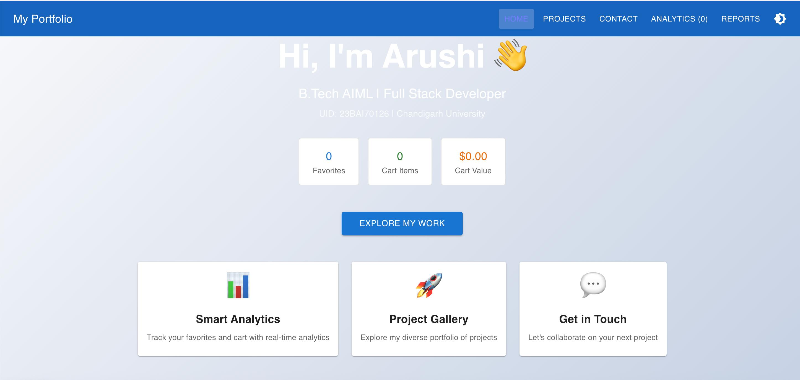
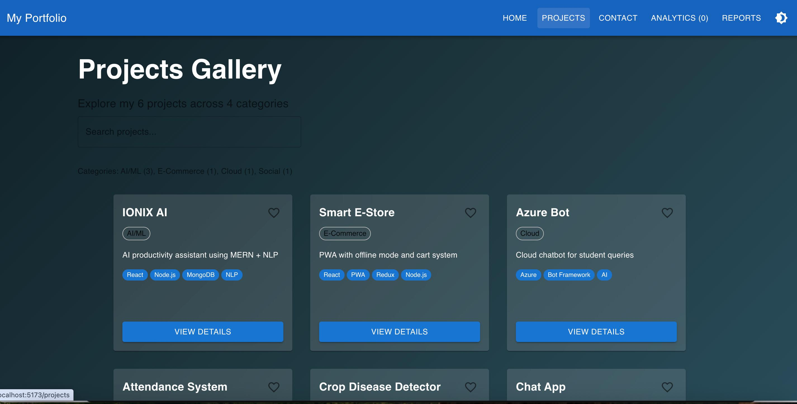
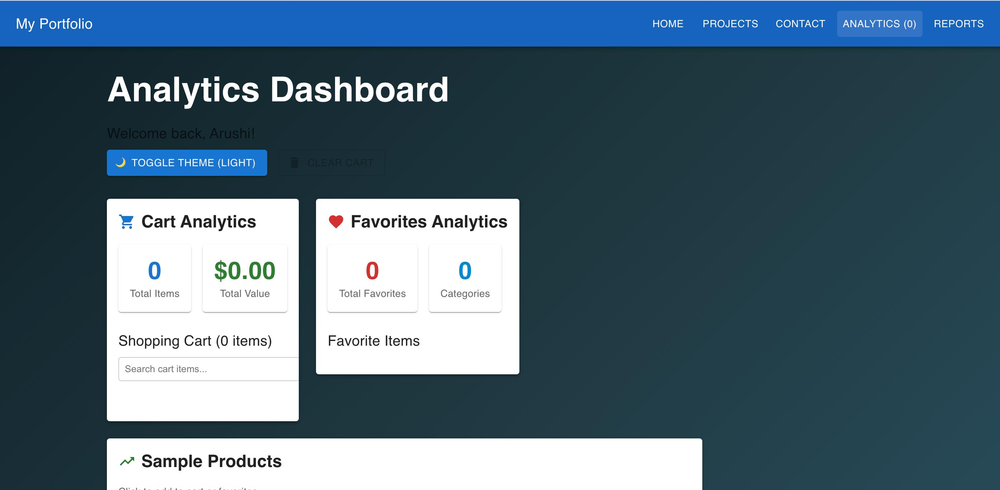
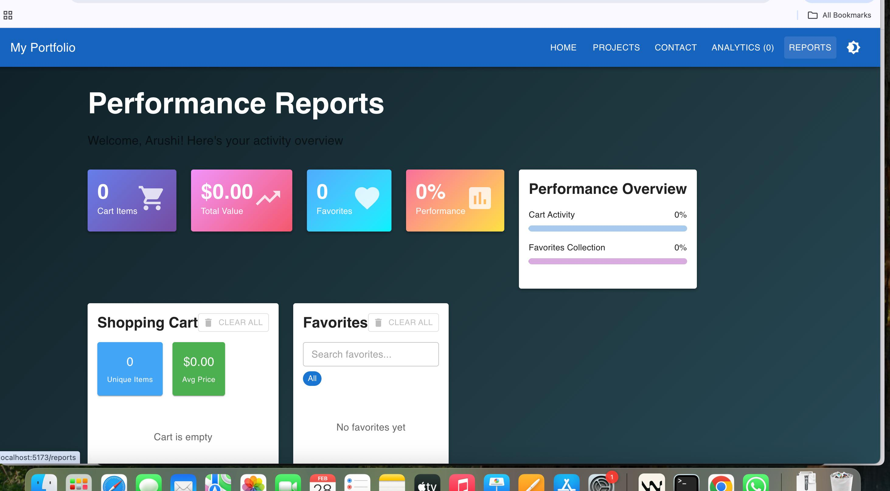

# Modern Portfolio - Experiment 5

A sophisticated React portfolio website enhanced with Redux Toolkit, Context API, and advanced React hooks.

## 🚀 Experiment 5 Updates

### ✅ New Features Implemented:
- **Redux Toolkit**: Replaced useReducer with Redux Toolkit for scalable state management
- **useContext**: Global state for theme and user profile (separate from Redux)
- **useMemo**: Performance optimization for derived calculations and filtered data
- **New Reports Page**: Comprehensive performance dashboard with real-time metrics

### 📁 Project Structure
```
src/
├── components/
│   ├── Navbar.jsx          # Uses Redux (useSelector) + Context (theme)
│   ├── Footer.jsx
│   ├── ProjectCard.jsx     # Enhanced with favorites and theme support
│   └── Skills.jsx
├── context/
│   └── AppContext.jsx      # Context for theme & user (simplified)
├── redux/
│   ├── store.js            # Redux store configuration
│   └── slices/
│       └── appSlice.js     # Redux slice with 7 actions
├── pages/
│   ├── Home.jsx            # Uses Redux + Context + useMemo
│   ├── Projects.jsx        # Uses Redux + Context + useMemo
│   ├── Contact.jsx
│   ├── Analytics.jsx       # Updated to use Redux
│   └── Reports.jsx         # ✅ NEW - Experiment 5 page
├── App.jsx                 # Wrapped with Redux Provider + AppProvider
└── main.jsx
```

## 🎯 Key Features

### Redux Toolkit State Management
- **Store Configuration**: Using `configureStore` from Redux Toolkit
- **App Slice**: Created with `createSlice` containing 7 reducers
- **Actions**: addToCart, removeFromCart, updateCartQuantity, clearCart, addToFavorites, removeFromFavorites, clearFavorites
- **Used in Components**: Navbar, Home, Projects, Analytics, Reports (5+ components)
- **Hooks**: `useSelector` for reading state, `useDispatch` for dispatching actions

### Global State Management (useContext)
- **Theme System**: Light/dark mode toggle across all components
- **User Profile**: Mock user data accessible globally
- **Separation of Concerns**: Context for UI state, Redux for data state

### Performance Optimization (useMemo)
- **Cart Metrics**: Total items, total value, average price calculations
- **Favorite Analytics**: Category breakdown, filtered favorites
- **Project Filtering**: Real-time search with memoized results
- **Performance Score**: Derived calculation based on cart and favorites activity
- **Prevents Re-renders**: All expensive calculations cached until dependencies change

### Analytics Dashboard
- **Real-time Statistics**: Cart value, item counts, favorite analytics
- **Interactive Demo**: Sample products to test cart/favorites functionality
- **Search & Filter**: Live search with memoized results
- **Category Insights**: Project distribution by category

## 🛠 Tech Stack

- **Frontend**: React 19, React Router DOM
- **UI Framework**: Material-UI (MUI) v7
- **State Management**: useContext + useReducer
- **Build Tool**: Vite
- **Styling**: Material-UI + Emotion

## 📱 Pages Overview

### Home
- Personalized greeting using context user data
- Quick stats dashboard (favorites, cart items, total value)
- Feature cards with navigation
- Theme-aware background gradients

### Projects Gallery
- Advanced search functionality (title, description, category, tech stack)
- Favorite toggle for each project
- Category and tech stack filtering
- Memoized statistics and filtered results
- Enhanced project cards with hover effects

### Analytics Dashboard
- Cart management with quantity controls
- Favorites management with category breakdown
- Sample products for demonstration
- Real-time statistics with useMemo optimization
- Theme toggle and cart management controls

## 🎨 UI/UX Features

- **Responsive Design**: Mobile-first approach with Material-UI breakpoints
- **Theme Support**: Complete light/dark mode implementation
- **Micro-interactions**: Hover effects, transitions, and animations
- **Modern Design**: Clean layout with proper spacing and typography
- **Accessibility**: Semantic HTML and ARIA-friendly components

## 📸 Screenshots

### 1. Home Page

*Home page featuring personalized greeting, quick stats dashboard (Favorites, Cart Items, Cart Value), and feature cards for navigation*

### 2. Projects Gallery

*Projects gallery with search functionality, category filtering, favorite toggle, and technology stack display*

### 3. Analytics Dashboard

*Analytics dashboard showing cart analytics, favorites analytics, theme toggle, and sample products for testing*

### 4. Reports Page (NEW - Experiment 5)

*Performance Reports dashboard with Redux-powered real-time metrics, cart management, favorites filtering, and performance overview*

All screenshots demonstrate:
- ✅ Redux Toolkit state management in action
- ✅ useContext for theme and user profile
- ✅ useMemo optimizations for derived data
- ✅ Responsive Material-UI design
- ✅ Interactive features (add to cart, favorites, search, filter)

## 🚀 Getting Started

1. Install dependencies:
   ```bash
   npm install
   ```

2. Start development server:
   ```bash
   npm run dev
   ```

3. Build for production:
   ```bash
   npm run build
   ```

## 📊 Experiment 5 Implementation Details

### Redux Toolkit Implementation
- **Store**: `store.js` configured using `configureStore`
- **Slice**: `appSlice.js` created with `createSlice`
- **7 Reducers**: addToCart, removeFromCart, updateCartQuantity, clearCart, addToFavorites, removeFromFavorites, clearFavorites
- **State Shape**: `{ favorites: [], cart: [] }`
- **Used in 5+ Components**: Navbar, Home, Projects, Analytics, Reports

### useContext Usage
- `AppContext.jsx` provides theme and user profile
- Simplified to focus on UI-related state only
- Used in all pages for theme toggling
- Separation of concerns: Context for UI, Redux for data

### useMemo Optimization
- **Reports Page**: Cart metrics, favorite metrics, performance score, filtered favorites
- **Home Page**: Quick stats calculations (favorites count, cart items, total value)
- **Projects Page**: Filtered projects, project statistics, category breakdown
- **Analytics Page**: Cart stats, favorite stats, filtered cart items
- Prevents unnecessary re-renders on every state change

### New Reports Page (Experiment 5)
- **Redux Integration**: Uses useSelector and useDispatch throughout
- **Real-time Metrics**: Performance score, cart analytics, favorite analytics
- **Interactive Features**: Add/remove cart items, manage favorites, search/filter
- **useMemo Optimizations**: All derived calculations are memoized
- **Context Integration**: Theme-aware styling and user profile display

## 🔧 Development Notes

- **Performance**: All expensive calculations are memoized with useMemo
- **State Architecture**: Redux Toolkit for data state, Context for UI state
- **Component Design**: Reusable components with prop interfaces
- **Redux Best Practices**: Using Redux Toolkit's createSlice and configureStore
- **Code Organization**: Following the recommended folder structure

## 📦 Experiment 5 Summary

### What Changed from Experiment 4:
1. **Replaced useReducer with Redux Toolkit** - More scalable and industry-standard
2. **Simplified Context** - Now only handles theme and user (UI concerns)
3. **Added Reports Page** - New comprehensive dashboard with performance metrics
4. **Enhanced useMemo Usage** - More optimizations across all pages
5. **Better Separation of Concerns** - Redux for data, Context for UI

### Screenshots Added:
- `/screenshots/home.png` - Home page with quick stats
- `/screenshots/reports.png` - New Reports dashboard
- `/screenshots/redux-feature.png` - Redux DevTools showing state

---

**UID**: 23BAI70126  
**Experiment**: 5 - Redux Toolkit + Advanced State Management  
**Deployment**: 23bai70126-5-arushi.vercel.app
